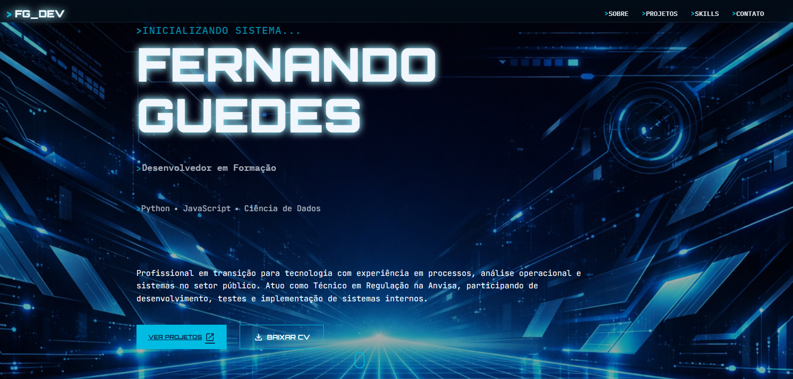

# Meu Portifólio em Landing Page

## Como fiz?

Solicitei ao Agente Manus para criar uma landing page com o tema do cyberpunk. Aí me foi entregue um projeto em typeScript, que eu nem sei usar, muito completo. 
Então decidi aproveitar o desing e desenvolver do zero. 

tentei replicar o design no Figma e estava evoluindo, mas demorei bastante, e aí parti para o código: Html, CSS e javaScript.

## Dificuldades Encontradas

A criação dos cards, e dos componentes puramente com html e css foi enriquecedora, mas muito trabalhosa. Durante o processo aprendi a usar a [lucide](https://lucide.dev/) o que foi de fato um aprendizado fantástico. Sempre acostumado a usar flexbox, foi necessário me aventurar no grid-layout para ajustar os cards. E fiquei impressionado em como é fácil usar.

Então para buscar os projetos no github, pensei em criar objetos com as informações dos projetos que queria mostrar, mas aí pensei: Por que não usar a api do github? Foi aí que fiquei na dúvida em usar o `fetch` do javascript, mas aí descobri outra ferramenta interessante e que facilitou tudo para mim: [Octokit](https://github.com/octokit) e buscar a api se tornou extremamente simples.

## Resultado

Estou muito feliz com o resultado do meu projeto e com certeza saí dele com um saldo de conhecimento altamente positivo. 

Espero que também goste 😉
