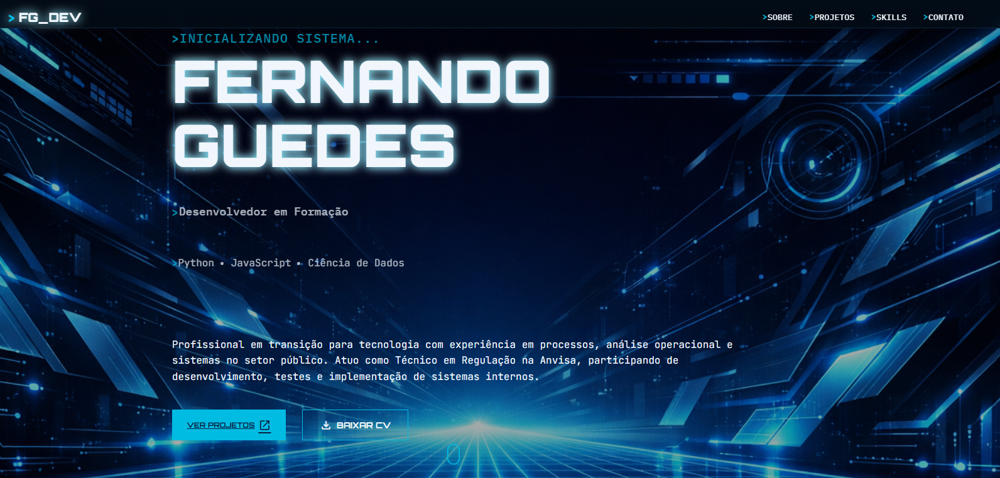

# Meu Portifólio em Landing Page

## Como fiz?

Solicitei ao Agente Manus para criar uma landing page com o tema do cyberpunk. Aí me foi entregue um projeto em typeScript, que eu nem sei usar, muito completo, por sinal, mas não me senti representado, foi então que decidi aproveitar o desing e desenvolver do zero.

Tentei replicar o design no Figma e estava evoluindo, mas demorei bastante, e aí parti para o código: Html, CSS e javaScript.

## Tecnologias utilizadas

      

## Dificuldades Encontradas

A criação dos cards, e dos componentes puramente com html e css foi enriquecedora, mas muito trabalhosa. Durante o processo aprendi a usar a [lucide](https://lucide.dev/) o que foi de fato um aprendizado fantástico. Sempre acostumado a usar flexbox, foi necessário me aventurar no grid-layout para ajustar os cards. E fiquei impressionado em como é fácil usar.

Então para buscar os projetos no github, pensei em criar objetos com as informações dos projetos que queria mostrar, mas aí pensei: Por que não usar a api do github? Foi aí que fiquei na dúvida em usar o `fetch` do javascript, mas aí descobri outra ferramenta interessante e que facilitou tudo para mim: [Octokit](https://github.com/octokit) e buscar a api se tornou extremamente simples.

## Revisando o Código

Com um tempo, fui compartilhar o link do meu portifólio e percebi que os ícones não estavam funcionando, aí percebi que o [lucide](https://lucide.dev/) havia removido, então tive de buscar os ícones em outras fontes, fazer o download para o diretório assets/images e então usar no código, e então decidi remover o `lucide`do meu projeto uma vez que correria o risco de outros ícones pararem de funcionar.

Outra coisa interessante no meu projeto. Não encontrei badges para `Manus`e para `Lucide` então decidi eu mesmo criar esses badges. Para isso tentei aprender a criar os badges com duas bibliotecas python diferentes: Pilow, utilizando a prórpria logo da tecnologia e Anybadge com a logo da marca em svg.

Mas o que aprendi a fazer com a IA e que me apeteceu para usar foi desenhar o badge ou a logo no inckscape e copiar o path do svg e com este path utilizar as bibliotecas: sys, re, os e base64. Com isso consegui criar o badges no estilo Shields.io e estão aqui neste README. Me diz você o que achou dos badges que criei para Manus e Lucide.

## Resultado

Estou muito feliz com o resultado do meu projeto e com certeza saí dele com um saldo de conhecimento altamente positivo.

[clique aqui](https://guedesindev.github.io/portifolio/) e acesse o meu resultado.

Espero que também goste 😉
